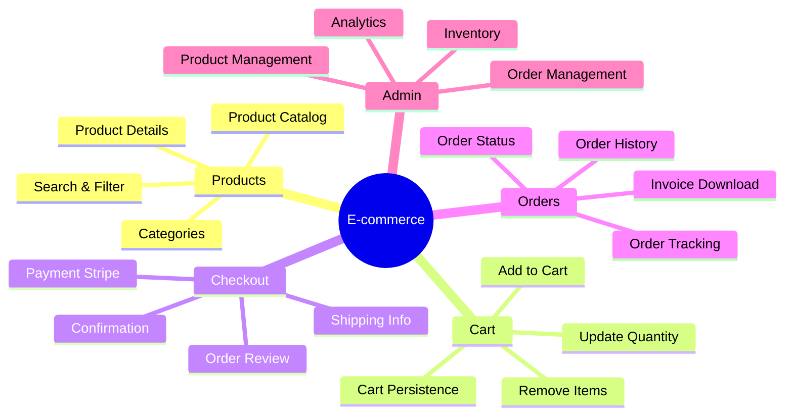
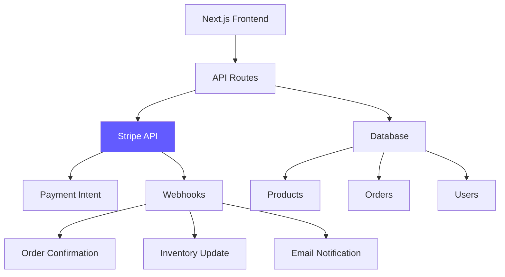

# Day 3 (Day 59): E-commerce with Stripe 💳

**Duration:** 8-10 hours | **Difficulty:** ⭐⭐⭐⭐ Project

---

## 📖 Project Overview

Build a full-featured e-commerce platform with real Stripe payment integration, order management, and email notifications.

---

## 🎯 Features



---

## 🏗️ Architecture



---

## 📊 Database Schema

```prisma
// prisma/schema.prisma
model Product {
  id          String   @id @default(cuid())
  name        String
  description String
  price       Decimal  @db.Decimal(10, 2)
  image       String
  images      String[]
  category    String
  stock       Int      @default(0)
  featured    Boolean  @default(false)
  createdAt   DateTime @default(now())
  updatedAt   DateTime @updatedAt
  
  orderItems  OrderItem[]
  
  @@index([category])
  @@index([featured])
}

model Order {
  id              String      @id @default(cuid())
  userId          String
  status          OrderStatus @default(PENDING)
  total           Decimal     @db.Decimal(10, 2)
  stripePaymentId String?
  
  // Shipping
  shippingName    String
  shippingEmail   String
  shippingAddress String
  shippingCity    String
  shippingPostal  String
  shippingCountry String
  
  createdAt       DateTime    @default(now())
  updatedAt       DateTime    @updatedAt
  
  items OrderItem[]
  
  @@index([userId])
  @@index([status])
}

enum OrderStatus {
  PENDING
  PROCESSING
  PAID
  SHIPPED
  DELIVERED
  CANCELLED
}

model OrderItem {
  id        String  @id @default(cuid())
  orderId   String
  productId String
  quantity  Int
  price     Decimal @db.Decimal(10, 2)
  
  order   Order   @relation(fields: [orderId], references: [id], onDelete: Cascade)
  product Product @relation(fields: [productId], references: [id])
  
  @@index([orderId])
  @@index([productId])
}
```

---

## 💳 Stripe Integration

### **Stripe Configuration**

```typescript
// lib/stripe.ts
import Stripe from 'stripe'

export const stripe = new Stripe(process.env.STRIPE_SECRET_KEY!, {
  apiVersion: '2023-10-16',
  typescript: true,
})
```

### **Create Payment Intent**

```typescript
// app/api/checkout/route.ts
import { NextRequest, NextResponse } from 'next/server'
import { stripe } from '@/lib/stripe'
import { db } from '@/lib/db'
import { getServerSession } from 'next-auth'

export async function POST(req: NextRequest) {
  try {
    const session = await getServerSession()
    
    if (!session) {
      return NextResponse.json({ error: 'Unauthorized' }, { status: 401 })
    }

    const { items, shipping } = await req.json()

    // Calculate total
    const productIds = items.map((item: any) => item.productId)
    const products = await db.product.findMany({
      where: { id: { in: productIds } }
    })

    let total = 0
    const orderItems = items.map((item: any) => {
      const product = products.find(p => p.id === item.productId)
      if (!product) throw new Error('Product not found')
      
      const price = Number(product.price)
      total += price * item.quantity
      
      return {
        productId: product.id,
        quantity: item.quantity,
        price: product.price
      }
    })

    // Create order in database
    const order = await db.order.create({
      data: {
        userId: session.user.id,
        total,
        status: 'PENDING',
        shippingName: shipping.name,
        shippingEmail: shipping.email,
        shippingAddress: shipping.address,
        shippingCity: shipping.city,
        shippingPostal: shipping.postal,
        shippingCountry: shipping.country,
        items: {
          create: orderItems
        }
      }
    })

    // Create Stripe Payment Intent
    const paymentIntent = await stripe.paymentIntents.create({
      amount: Math.round(total * 100), // Convert to cents
      currency: 'usd',
      metadata: {
        orderId: order.id
      },
      automatic_payment_methods: {
        enabled: true,
      },
    })

    return NextResponse.json({
      clientSecret: paymentIntent.client_secret,
      orderId: order.id
    })
  } catch (error) {
    console.error('Checkout error:', error)
    return NextResponse.json(
      { error: 'Internal server error' },
      { status: 500 }
    )
  }
}
```

---

## 🛒 Shopping Cart

### **Cart Store**

```typescript
// store/cart.ts
import { create } from 'zustand'
import { persist } from 'zustand/middleware'

interface CartItem {
  productId: string
  name: string
  price: number
  image: string
  quantity: number
}

interface CartStore {
  items: CartItem[]
  addItem: (item: CartItem) => void
  removeItem: (productId: string) => void
  updateQuantity: (productId: string, quantity: number) => void
  clearCart: () => void
  getTotal: () => number
  getItemCount: () => number
}

export const useCart = create<CartStore>()(
  persist(
    (set, get) => ({
      items: [],
      
      addItem: (item) => {
        set((state) => {
          const existing = state.items.find(i => i.productId === item.productId)
          
          if (existing) {
            return {
              items: state.items.map(i =>
                i.productId === item.productId
                  ? { ...i, quantity: i.quantity + item.quantity }
                  : i
              )
            }
          }
          
          return { items: [...state.items, item] }
        })
      },
      
      removeItem: (productId) => {
        set((state) => ({
          items: state.items.filter(i => i.productId !== productId)
        }))
      },
      
      updateQuantity: (productId, quantity) => {
        set((state) => ({
          items: state.items.map(i =>
            i.productId === productId ? { ...i, quantity } : i
          )
        }))
      },
      
      clearCart: () => {
        set({ items: [] })
      },
      
      getTotal: () => {
        return get().items.reduce((total, item) => {
          return total + (item.price * item.quantity)
        }, 0)
      },
      
      getItemCount: () => {
        return get().items.reduce((count, item) => count + item.quantity, 0)
      }
    }),
    {
      name: 'cart-storage',
    }
  )
)
```

### **Cart Component**

```typescript
// components/cart/Cart.tsx
'use client'

import { ShoppingCart, X } from 'lucide-react'
import { useCart } from '@/store/cart'
import { Button } from '@/components/ui/button'
import {
  Sheet,
  SheetContent,
  SheetHeader,
  SheetTitle,
  SheetTrigger,
} from '@/components/ui/sheet'
import { useRouter } from 'next/navigation'

export function Cart() {
  const router = useRouter()
  const { items, removeItem, updateQuantity, getTotal, getItemCount } = useCart()
  const itemCount = getItemCount()

  return (
    <Sheet>
      <SheetTrigger asChild>
        <Button variant="outline" size="icon" className="relative">
          <ShoppingCart className="h-5 w-5" />
          {itemCount > 0 && (
            <span className="absolute -top-2 -right-2 bg-red-500 text-white text-xs rounded-full h-5 w-5 flex items-center justify-center">
              {itemCount}
            </span>
          )}
        </Button>
      </SheetTrigger>
      
      <SheetContent className="w-full sm:max-w-lg">
        <SheetHeader>
          <SheetTitle>Shopping Cart ({itemCount})</SheetTitle>
        </SheetHeader>
        
        {items.length === 0 ? (
          <div className="flex flex-col items-center justify-center h-full gap-4">
            <ShoppingCart className="h-16 w-16 text-gray-400" />
            <p className="text-gray-500">Your cart is empty</p>
          </div>
        ) : (
          <div className="flex flex-col h-full">
            <div className="flex-1 overflow-y-auto py-4">
              {items.map((item) => (
                <div key={item.productId} className="flex gap-4 py-4 border-b">
                  
                  
                  <div className="flex-1">
                    <h3 className="font-medium">{item.name}</h3>
                    <p className="text-sm text-gray-500">
                      ${item.price.toFixed(2)}
                    </p>
                    
                    <div className="flex items-center gap-2 mt-2">
                      <Button
                        size="sm"
                        variant="outline"
                        onClick={() =>
                          updateQuantity(item.productId, Math.max(1, item.quantity - 1))
                        }
                      >
                        -
                      </Button>
                      <span>{item.quantity}</span>
                      <Button
                        size="sm"
                        variant="outline"
                        onClick={() =>
                          updateQuantity(item.productId, item.quantity + 1)
                        }
                      >
                        +
                      </Button>
                    </div>
                  </div>
                  
                  <button
                    onClick={() => removeItem(item.productId)}
                    className="text-red-500 hover:text-red-700"
                  >
                    <X className="h-5 w-5" />
                  </button>
                </div>
              ))}
            </div>
            
            <div className="border-t pt-4">
              <div className="flex justify-between text-lg font-bold mb-4">
                <span>Total:</span>
                <span>${getTotal().toFixed(2)}</span>
              </div>
              
              <Button
                className="w-full"
                onClick={() => router.push('/checkout')}
              >
                Proceed to Checkout
              </Button>
            </div>
          </div>
        )}
      </SheetContent>
    </Sheet>
  )
}
```

---

## 💳 Checkout Form

```typescript
// app/checkout/page.tsx
'use client'

import { useState } from 'react'
import { Elements } from '@stripe/react-stripe-js'
import { loadStripe } from '@stripe/stripe-js'
import { CheckoutForm } from '@/components/checkout/CheckoutForm'
import { useCart } from '@/store/cart'

const stripePromise = loadStripe(process.env.NEXT_PUBLIC_STRIPE_PUBLISHABLE_KEY!)

export default function CheckoutPage() {
  const { items, getTotal } = useCart()
  const [clientSecret, setClientSecret] = useState('')
  const [shipping, setShipping] = useState({
    name: '',
    email: '',
    address: '',
    city: '',
    postal: '',
    country: ''
  })

  const createPaymentIntent = async () => {
    const res = await fetch('/api/checkout', {
      method: 'POST',
      headers: { 'Content-Type': 'application/json' },
      body: JSON.stringify({ items, shipping })
    })
    
    const data = await res.json()
    setClientSecret(data.clientSecret)
  }

  return (
    <div className="container mx-auto py-8 max-w-4xl">
      <h1 className="text-3xl font-bold mb-8">Checkout</h1>
      
      <div className="grid md:grid-cols-2 gap-8">
        <div>
          <h2 className="text-xl font-semibold mb-4">Shipping Information</h2>
          {/* Shipping form */}
          <Button onClick={createPaymentIntent}>Continue to Payment</Button>
        </div>
        
        <div>
          <h2 className="text-xl font-semibold mb-4">Order Summary</h2>
          {items.map((item) => (
            <div key={item.productId} className="flex justify-between py-2">
              <span>{item.name} × {item.quantity}</span>
              <span>${(item.price * item.quantity).toFixed(2)}</span>
            </div>
          ))}
          <div className="border-t mt-4 pt-4">
            <div className="flex justify-between font-bold text-lg">
              <span>Total:</span>
              <span>${getTotal().toFixed(2)}</span>
            </div>
          </div>
        </div>
      </div>
      
      {clientSecret && (
        <Elements stripe={stripePromise} options={{ clientSecret }}>
          <CheckoutForm />
        </Elements>
      )}
    </div>
  )
}
```

---

## 📧 Webhook Handler

```typescript
// app/api/webhooks/stripe/route.ts
import { NextRequest, NextResponse } from 'next/server'
import { stripe } from '@/lib/stripe'
import { db } from '@/lib/db'
import { sendEmail } from '@/lib/email'

export async function POST(req: NextRequest) {
  const body = await req.text()
  const signature = req.headers.get('stripe-signature')!

  let event: Stripe.Event

  try {
    event = stripe.webhooks.constructEvent(
      body,
      signature,
      process.env.STRIPE_WEBHOOK_SECRET!
    )
  } catch (error) {
    return NextResponse.json({ error: 'Invalid signature' }, { status: 400 })
  }

  if (event.type === 'payment_intent.succeeded') {
    const paymentIntent = event.data.object as Stripe.PaymentIntent
    const orderId = paymentIntent.metadata.orderId

    // Update order status
    const order = await db.order.update({
      where: { id: orderId },
      data: {
        status: 'PAID',
        stripePaymentId: paymentIntent.id
      },
      include: {
        items: {
          include: {
            product: true
          }
        }
      }
    })

    // Update inventory
    for (const item of order.items) {
      await db.product.update({
        where: { id: item.productId },
        data: {
          stock: {
            decrement: item.quantity
          }
        }
      })
    }

    // Send confirmation email
    await sendEmail({
      to: order.shippingEmail,
      subject: 'Order Confirmation',
      template: 'order-confirmation',
      data: { order }
    })
  }

  return NextResponse.json({ received: true })
}
```

---

## ✅ Implementation Checklist

- [ ] Database schema for products and orders
- [ ] Product catalog with search/filter
- [ ] Shopping cart with persistence
- [ ] Stripe payment integration
- [ ] Checkout flow
- [ ] Webhook handler
- [ ] Order confirmation emails
- [ ] Order history page
- [ ] Admin dashboard
- [ ] Inventory management
- [ ] Invoice generation
- [ ] Responsive design

---

**Tomorrow:** AI-Powered Application! 🤖
