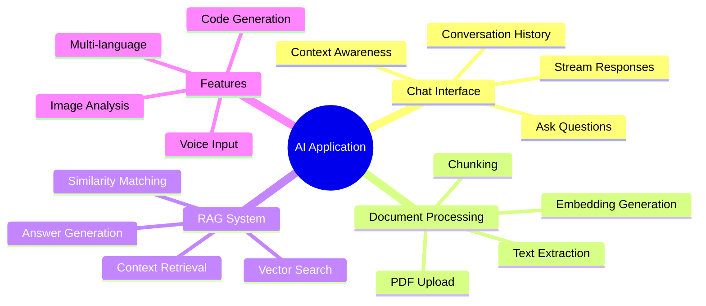
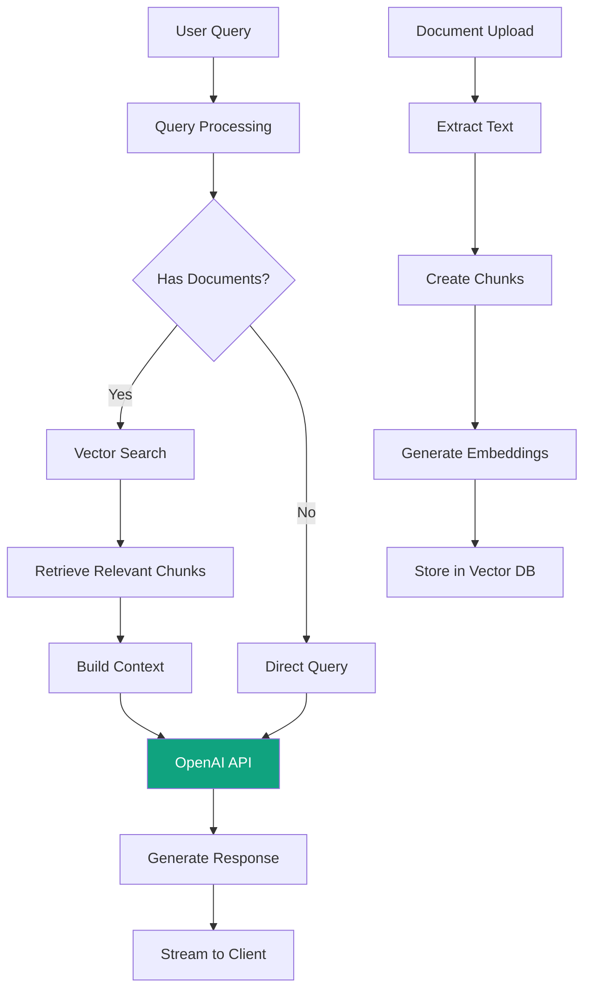

# Day 4 (Day 60): AI-Powered Application 🤖

**Duration:** 8-10 hours | **Difficulty:** ⭐⭐⭐⭐ Project

---

## 📖 Project Overview

Build an AI-powered application using OpenAI API with document upload, embeddings, and RAG (Retrieval-Augmented Generation) pattern.

---

## 🎯 Features



---

## 🏗️ Architecture



---

## 📊 Database Schema

```prisma
// prisma/schema.prisma
model Conversation {
  id        String   @id @default(cuid())
  userId    String
  title     String?
  createdAt DateTime @default(now())
  updatedAt DateTime @updatedAt
  
  messages  Message[]
  
  @@index([userId])
}

model Message {
  id             String       @id @default(cuid())
  conversationId String
  role           MessageRole
  content        String       @db.Text
  createdAt      DateTime     @default(now())
  
  conversation Conversation @relation(fields: [conversationId], references: [id], onDelete: Cascade)
  
  @@index([conversationId])
}

enum MessageRole {
  USER
  ASSISTANT
  SYSTEM
}

model Document {
  id        String   @id @default(cuid())
  userId    String
  name      String
  type      String
  size      Int
  url       String
  createdAt DateTime @default(now())
  
  chunks DocumentChunk[]
  
  @@index([userId])
}

model DocumentChunk {
  id         String   @id @default(cuid())
  documentId String
  content    String   @db.Text
  embedding  Float[]
  index      Int
  createdAt  DateTime @default(now())
  
  document Document @relation(fields: [documentId], references: [id], onDelete: Cascade)
  
  @@index([documentId])
}
```

---

## 🤖 OpenAI Integration

### **Chat API**

```typescript
// app/api/chat/route.ts
import { NextRequest, NextResponse } from 'next/server'
import OpenAI from 'openai'
import { OpenAIStream, StreamingTextResponse } from 'ai'
import { db } from '@/lib/db'

const openai = new OpenAI({
  apiKey: process.env.OPENAI_API_KEY,
})

export const runtime = 'edge'

export async function POST(req: NextRequest) {
  try {
    const { messages, conversationId, useRAG } = await req.json()

    let contextMessages = messages

    // If RAG is enabled, retrieve relevant context
    if (useRAG && messages[messages.length - 1].role === 'user') {
      const query = messages[messages.length - 1].content
      const relevantChunks = await retrieveRelevantChunks(query)
      
      if (relevantChunks.length > 0) {
        const context = relevantChunks.map(chunk => chunk.content).join('\n\n')
        
        contextMessages = [
          {
            role: 'system',
            content: `You are a helpful assistant. Use the following context to answer the user's question:\n\n${context}`
          },
          ...messages
        ]
      }
    }

    // Create OpenAI chat completion with streaming
    const response = await openai.chat.completions.create({
      model: 'gpt-4-turbo-preview',
      stream: true,
      messages: contextMessages,
      temperature: 0.7,
      max_tokens: 2000,
    })

    // Convert to stream response
    const stream = OpenAIStream(response, {
      async onCompletion(completion) {
        // Save assistant response
        await db.message.create({
          data: {
            conversationId,
            role: 'ASSISTANT',
            content: completion
          }
        })
      }
    })

    return new StreamingTextResponse(stream)
  } catch (error) {
    console.error('Chat API error:', error)
    return NextResponse.json(
      { error: 'Internal server error' },
      { status: 500 }
    )
  }
}

async function retrieveRelevantChunks(query: string) {
  // Generate query embedding
  const embeddingResponse = await openai.embeddings.create({
    model: 'text-embedding-ada-002',
    input: query,
  })
  
  const queryEmbedding = embeddingResponse.data[0].embedding

  // Vector similarity search
  // This is simplified - in production, use a vector database like Pinecone or Weaviate
  const allChunks = await db.documentChunk.findMany({
    take: 100,
    orderBy: { createdAt: 'desc' }
  })

  const chunksWithSimilarity = allChunks.map(chunk => ({
    ...chunk,
    similarity: cosineSimilarity(queryEmbedding, chunk.embedding)
  }))

  // Sort by similarity and get top 3
  return chunksWithSimilarity
    .sort((a, b) => b.similarity - a.similarity)
    .slice(0, 3)
}

function cosineSimilarity(a: number[], b: number[]): number {
  const dotProduct = a.reduce((sum, val, i) => sum + val * b[i], 0)
  const magnitudeA = Math.sqrt(a.reduce((sum, val) => sum + val * val, 0))
  const magnitudeB = Math.sqrt(b.reduce((sum, val) => sum + val * val, 0))
  return dotProduct / (magnitudeA * magnitudeB)
}
```

---

## 📄 Document Upload & Processing

### **Upload API**

```typescript
// app/api/documents/upload/route.ts
import { NextRequest, NextResponse } from 'next/server'
import { put } from '@vercel/blob'
import { db } from '@/lib/db'
import { extractTextFromPDF } from '@/lib/pdf'
import { generateEmbeddings } from '@/lib/embeddings'
import { getServerSession } from 'next-auth'

export async function POST(req: NextRequest) {
  try {
    const session = await getServerSession()
    if (!session) {
      return NextResponse.json({ error: 'Unauthorized' }, { status: 401 })
    }

    const formData = await req.formData()
    const file = formData.get('file') as File
    
    if (!file) {
      return NextResponse.json({ error: 'No file provided' }, { status: 400 })
    }

    // Upload to Vercel Blob
    const blob = await put(file.name, file, {
      access: 'public',
    })

    // Extract text from PDF
    const text = await extractTextFromPDF(file)

    // Create document record
    const document = await db.document.create({
      data: {
        userId: session.user.id,
        name: file.name,
        type: file.type,
        size: file.size,
        url: blob.url,
      }
    })

    // Process in background
    processDocument(document.id, text)

    return NextResponse.json({ document })
  } catch (error) {
    console.error('Upload error:', error)
    return NextResponse.json(
      { error: 'Upload failed' },
      { status: 500 }
    )
  }
}

async function processDocument(documentId: string, text: string) {
  // Split text into chunks
  const chunks = splitIntoChunks(text, 1000)

  // Generate embeddings for each chunk
  for (let i = 0; i < chunks.length; i++) {
    const embedding = await generateEmbeddings(chunks[i])
    
    await db.documentChunk.create({
      data: {
        documentId,
        content: chunks[i],
        embedding,
        index: i
      }
    })
  }
}

function splitIntoChunks(text: string, chunkSize: number): string[] {
  const chunks: string[] = []
  const words = text.split(' ')
  
  for (let i = 0; i < words.length; i += chunkSize) {
    chunks.push(words.slice(i, i + chunkSize).join(' '))
  }
  
  return chunks
}
```

### **Embeddings Generation**

```typescript
// lib/embeddings.ts
import OpenAI from 'openai'

const openai = new OpenAI({
  apiKey: process.env.OPENAI_API_KEY,
})

export async function generateEmbeddings(text: string): Promise<number[]> {
  const response = await openai.embeddings.create({
    model: 'text-embedding-ada-002',
    input: text,
  })
  
  return response.data[0].embedding
}
```

---

## 💬 Chat Interface

### **Chat Component**

```typescript
// components/chat/ChatInterface.tsx
'use client'

import { useState, useRef, useEffect } from 'react'
import { useChat } from 'ai/react'
import { Send, Loader2 } from 'lucide-react'
import { Button } from '@/components/ui/button'
import { Textarea } from '@/components/ui/textarea'
import { Avatar, AvatarFallback } from '@/components/ui/avatar'
import { cn } from '@/lib/utils'

export function ChatInterface({ conversationId }: { conversationId: string }) {
  const {
    messages,
    input,
    handleInputChange,
    handleSubmit,
    isLoading,
  } = useChat({
    api: '/api/chat',
    body: {
      conversationId,
      useRAG: true
    }
  })

  const messagesEndRef = useRef<HTMLDivElement>(null)

  useEffect(() => {
    messagesEndRef.current?.scrollIntoView({ behavior: 'smooth' })
  }, [messages])

  return (
    <div className="flex flex-col h-full">
      {/* Messages */}
      <div className="flex-1 overflow-y-auto p-4 space-y-4">
        {messages.map((message) => (
          <div
            key={message.id}
            className={cn(
              'flex gap-3',
              message.role === 'user' && 'flex-row-reverse'
            )}
          >
            <Avatar className="w-8 h-8">
              <AvatarFallback>
                {message.role === 'user' ? 'U' : 'AI'}
              </AvatarFallback>
            </Avatar>

            <div
              className={cn(
                'max-w-[80%] rounded-lg p-4',
                message.role === 'user'
                  ? 'bg-blue-500 text-white'
                  : 'bg-gray-100 dark:bg-gray-800'
              )}
            >
              <div className="prose dark:prose-invert">
                {message.content}
              </div>
            </div>
          </div>
        ))}
        
        {isLoading && (
          <div className="flex gap-3">
            <Avatar className="w-8 h-8">
              <AvatarFallback>AI</AvatarFallback>
            </Avatar>
            <div className="bg-gray-100 dark:bg-gray-800 rounded-lg p-4">
              <Loader2 className="w-5 h-5 animate-spin" />
            </div>
          </div>
        )}

        <div ref={messagesEndRef} />
      </div>

      {/* Input */}
      <form onSubmit={handleSubmit} className="border-t p-4">
        <div className="flex gap-2">
          <Textarea
            value={input}
            onChange={handleInputChange}
            placeholder="Ask anything..."
            className="min-h-[60px]"
            onKeyPress={(e) => {
              if (e.key === 'Enter' && !e.shiftKey) {
                e.preventDefault()
                handleSubmit(e)
              }
            }}
          />
          <Button
            type="submit"
            disabled={isLoading || !input.trim()}
          >
            <Send className="w-5 h-5" />
          </Button>
        </div>
      </form>
    </div>
  )
}
```

---

## 🎨 Advanced Features

### **Code Generation**

```typescript
// Add system prompt for code generation
const codeSystemPrompt = `You are an expert programmer. When asked to generate code:
1. Provide clean, well-commented code
2. Follow best practices
3. Include error handling
4. Explain the code briefly
`
```

### **Image Analysis (GPT-4 Vision)**

```typescript
// app/api/analyze-image/route.ts
export async function POST(req: NextRequest) {
  const { imageUrl, question } = await req.json()

  const response = await openai.chat.completions.create({
    model: 'gpt-4-vision-preview',
    messages: [
      {
        role: 'user',
        content: [
          { type: 'text', text: question },
          { type: 'image_url', image_url: { url: imageUrl } }
        ]
      }
    ],
    max_tokens: 1000,
  })

  return NextResponse.json({ 
    answer: response.choices[0].message.content 
  })
}
```

---

## ✅ Implementation Checklist

- [ ] OpenAI API integration
- [ ] Streaming chat responses
- [ ] Document upload system
- [ ] PDF text extraction
- [ ] Text chunking
- [ ] Embedding generation
- [ ] Vector similarity search
- [ ] RAG implementation
- [ ] Conversation history
- [ ] Code generation
- [ ] Image analysis (GPT-4 Vision)
- [ ] Multi-language support
- [ ] Export conversations

---

**Tomorrow:** Analytics Dashboard! 📊
