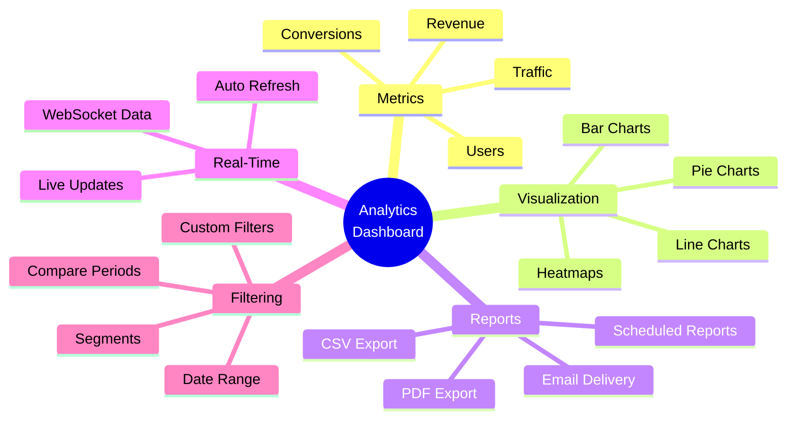
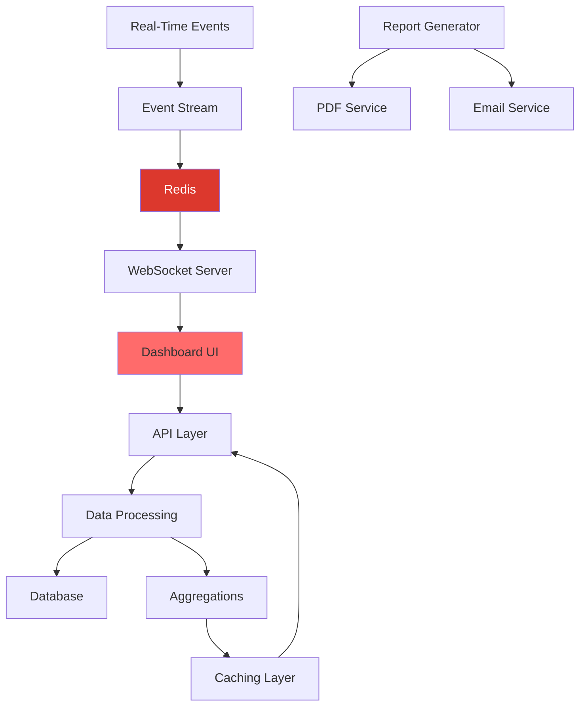

# Day 5 (Day 61): Analytics Dashboard 📊

**Duration:** 6-8 hours | **Difficulty:** ⭐⭐⭐ Project

---

## 📖 Project Overview

Build a comprehensive analytics dashboard with data visualization, real-time metrics, and report generation.

---

## 🎯 Features



---

## 🏗️ Architecture



---

## 📊 Database Schema

```prisma
// prisma/schema.prisma
model AnalyticsEvent {
  id         String   @id @default(cuid())
  userId     String?
  eventType  String
  eventData  Json
  url        String?
  userAgent  String?
  ip         String?
  createdAt  DateTime @default(now())
  
  @@index([eventType])
  @@index([createdAt])
  @@index([userId])
}

model DailyMetrics {
  id          String   @id @default(cuid())
  date        DateTime @unique
  
  // User metrics
  totalUsers  Int      @default(0)
  newUsers    Int      @default(0)
  activeUsers Int      @default(0)
  
  // Engagement metrics
  pageViews   Int      @default(0)
  sessions    Int      @default(0)
  avgDuration Float    @default(0)
  
  // Revenue metrics
  revenue     Decimal  @db.Decimal(10, 2) @default(0)
  orders      Int      @default(0)
  avgOrderValue Decimal @db.Decimal(10, 2) @default(0)
  
  // Conversion metrics
  conversionRate Float  @default(0)
  bounceRate     Float  @default(0)
  
  createdAt   DateTime @default(now())
  updatedAt   DateTime @updatedAt
  
  @@index([date])
}

model Report {
  id         String     @id @default(cuid())
  userId     String
  name       String
  type       ReportType
  config     Json
  schedule   String?
  lastRunAt  DateTime?
  createdAt  DateTime   @default(now())
  
  @@index([userId])
}

enum ReportType {
  REVENUE
  USERS
  ENGAGEMENT
  CUSTOM
}
```

---

## 📈 Data Visualization

### **Dashboard Overview**

```typescript
// app/dashboard/page.tsx
import { Suspense } from 'react'
import { MetricsCards } from '@/components/dashboard/MetricsCards'
import { RevenueChart } from '@/components/dashboard/RevenueChart'
import { UsersChart } from '@/components/dashboard/UsersChart'
import { TopPages } from '@/components/dashboard/TopPages'
import { RealtimeUsers } from '@/components/dashboard/RealtimeUsers'
import { DateRangePicker } from '@/components/dashboard/DateRangePicker'

export default function DashboardPage() {
  return (
    <div className="container mx-auto p-6 space-y-6">
      <div className="flex justify-between items-center">
        <h1 className="text-3xl font-bold">Analytics Dashboard</h1>
        <DateRangePicker />
      </div>

      {/* Key Metrics */}
      <Suspense fallback={<MetricsSkeleton />}>
        <MetricsCards />
      </Suspense>

      {/* Charts Grid */}
      <div className="grid md:grid-cols-2 gap-6">
        <Suspense fallback={<ChartSkeleton />}>
          <RevenueChart />
        </Suspense>
        
        <Suspense fallback={<ChartSkeleton />}>
          <UsersChart />
        </Suspense>
      </div>

      {/* Real-time & Top Pages */}
      <div className="grid md:grid-cols-3 gap-6">
        <div className="md:col-span-2">
          <Suspense fallback={<ChartSkeleton />}>
            <TopPages />
          </Suspense>
        </div>
        
        <Suspense fallback={<div>Loading...</div>}>
          <RealtimeUsers />
        </Suspense>
      </div>
    </div>
  )
}
```

### **Metrics Cards**

```typescript
// components/dashboard/MetricsCards.tsx
import { db } from '@/lib/db'
import { TrendingUp, Users, DollarSign, Activity } from 'lucide-react'
import { Card, CardContent, CardHeader, CardTitle } from '@/components/ui/card'

export async function MetricsCards() {
  const today = new Date()
  const yesterday = new Date(today)
  yesterday.setDate(yesterday.getDate() - 1)

  const [todayMetrics, yesterdayMetrics] = await Promise.all([
    db.dailyMetrics.findUnique({ where: { date: today } }),
    db.dailyMetrics.findUnique({ where: { date: yesterday } })
  ])

  const metrics = [
    {
      title: 'Total Revenue',
      value: `$${todayMetrics?.revenue || 0}`,
      change: calculateChange(
        Number(todayMetrics?.revenue || 0),
        Number(yesterdayMetrics?.revenue || 0)
      ),
      icon: DollarSign,
      color: 'text-green-600'
    },
    {
      title: 'Active Users',
      value: todayMetrics?.activeUsers || 0,
      change: calculateChange(
        todayMetrics?.activeUsers || 0,
        yesterdayMetrics?.activeUsers || 0
      ),
      icon: Users,
      color: 'text-blue-600'
    },
    {
      title: 'Conversion Rate',
      value: `${(todayMetrics?.conversionRate || 0).toFixed(2)}%`,
      change: calculateChange(
        todayMetrics?.conversionRate || 0,
        yesterdayMetrics?.conversionRate || 0
      ),
      icon: TrendingUp,
      color: 'text-purple-600'
    },
    {
      title: 'Avg. Session',
      value: `${(todayMetrics?.avgDuration || 0).toFixed(1)}m`,
      change: calculateChange(
        todayMetrics?.avgDuration || 0,
        yesterdayMetrics?.avgDuration || 0
      ),
      icon: Activity,
      color: 'text-orange-600'
    }
  ]

  return (
    <div className="grid gap-4 md:grid-cols-2 lg:grid-cols-4">
      {metrics.map((metric) => (
        <Card key={metric.title}>
          <CardHeader className="flex flex-row items-center justify-between pb-2">
            <CardTitle className="text-sm font-medium">
              {metric.title}
            </CardTitle>
            <metric.icon className={`h-4 w-4 ${metric.color}`} />
          </CardHeader>
          <CardContent>
            <div className="text-2xl font-bold">{metric.value}</div>
            <p className={`text-xs ${metric.change >= 0 ? 'text-green-600' : 'text-red-600'}`}>
              {metric.change >= 0 ? '+' : ''}{metric.change.toFixed(1)}% from yesterday
            </p>
          </CardContent>
        </Card>
      ))}
    </div>
  )
}

function calculateChange(current: number, previous: number): number {
  if (previous === 0) return current > 0 ? 100 : 0
  return ((current - previous) / previous) * 100
}
```

---

## 📊 Charts with Recharts

### **Revenue Chart**

```typescript
// components/dashboard/RevenueChart.tsx
'use client'

import { useQuery } from '@tanstack/react-query'
import {
  LineChart,
  Line,
  XAxis,
  YAxis,
  CartesianGrid,
  Tooltip,
  ResponsiveContainer
} from 'recharts'
import { Card, CardContent, CardHeader, CardTitle } from '@/components/ui/card'

export function RevenueChart() {
  const { data, isLoading } = useQuery({
    queryKey: ['revenue-chart'],
    queryFn: async () => {
      const res = await fetch('/api/analytics/revenue')
      return res.json()
    }
  })

  if (isLoading) {
    return <div>Loading chart...</div>
  }

  return (
    <Card>
      <CardHeader>
        <CardTitle>Revenue Overview</CardTitle>
      </CardHeader>
      <CardContent>
        <ResponsiveContainer width="100%" height={300}>
          <LineChart data={data}>
            <CartesianGrid strokeDasharray="3 3" />
            <XAxis dataKey="date" />
            <YAxis />
            <Tooltip />
            <Line
              type="monotone"
              dataKey="revenue"
              stroke="#8884d8"
              strokeWidth={2}
            />
          </LineChart>
        </ResponsiveContainer>
      </CardContent>
    </Card>
  )
}
```

---

## 🔴 Real-Time Analytics

### **Real-Time Users**

```typescript
// components/dashboard/RealtimeUsers.tsx
'use client'

import { useEffect, useState } from 'react'
import { useSocket } from '@/hooks/useSocket'
import { Card, CardContent, CardHeader, CardTitle } from '@/components/ui/card'
import { Activity } from 'lucide-react'

export function RealtimeUsers() {
  const [activeUsers, setActiveUsers] = useState(0)
  const { socket } = useSocket()

  useEffect(() => {
    if (!socket) return

    socket.on('active-users-update', (count: number) => {
      setActiveUsers(count)
    })

    return () => {
      socket.off('active-users-update')
    }
  }, [socket])

  return (
    <Card>
      <CardHeader>
        <CardTitle className="flex items-center gap-2">
          <Activity className="h-4 w-4 text-green-600 animate-pulse" />
          Real-time Users
        </CardTitle>
      </CardHeader>
      <CardContent>
        <div className="text-4xl font-bold">{activeUsers}</div>
        <p className="text-sm text-gray-500 mt-2">
          Active users right now
        </p>
      </CardContent>
    </Card>
  )
}
```

---

## 📄 Report Generation

### **PDF Report**

```typescript
// app/api/reports/generate/route.ts
import { NextRequest, NextResponse } from 'next/server'
import { db } from '@/lib/db'
import puppeteer from 'puppeteer'

export async function POST(req: NextRequest) {
  try {
    const { startDate, endDate, type } = await req.json()

    // Fetch data
    const metrics = await db.dailyMetrics.findMany({
      where: {
        date: {
          gte: new Date(startDate),
          lte: new Date(endDate)
        }
      },
      orderBy: { date: 'asc' }
    })

    // Generate HTML report
    const html = generateReportHTML(metrics, type)

    // Convert to PDF
    const browser = await puppeteer.launch()
    const page = await browser.newPage()
    await page.setContent(html)
    const pdf = await page.pdf({
      format: 'A4',
      printBackground: true
    })
    await browser.close()

    return new NextResponse(pdf, {
      headers: {
        'Content-Type': 'application/pdf',
        'Content-Disposition': `attachment; filename="report-${Date.now()}.pdf"`
      }
    })
  } catch (error) {
    console.error('Report generation error:', error)
    return NextResponse.json(
      { error: 'Failed to generate report' },
      { status: 500 }
    )
  }
}

function generateReportHTML(metrics: any[], type: string): string {
  return `
    <!DOCTYPE html>
    <html>
      <head>
        <style>
          body { font-family: Arial, sans-serif; padding: 40px; }
          h1 { color: #333; }
          table { width: 100%; border-collapse: collapse; margin-top: 20px; }
          th, td { padding: 12px; text-align: left; border-bottom: 1px solid #ddd; }
          th { background-color: #f2f2f2; }
        </style>
      </head>
      <body>
        <h1>Analytics Report</h1>
        <p>Generated on ${new Date().toLocaleDateString()}</p>
        
        <table>
          <thead>
            <tr>
              <th>Date</th>
              <th>Users</th>
              <th>Revenue</th>
              <th>Orders</th>
            </tr>
          </thead>
          <tbody>
            ${metrics.map(m => `
              <tr>
                <td>${new Date(m.date).toLocaleDateString()}</td>
                <td>${m.activeUsers}</td>
                <td>$${m.revenue}</td>
                <td>${m.orders}</td>
              </tr>
            `).join('')}
          </tbody>
        </table>
      </body>
    </html>
  `
}
```

---

## 📧 Email Reports

```typescript
// lib/email-reports.ts
import { sendEmail } from './email'
import { generateReport } from './reports'

export async function sendScheduledReport(reportId: string) {
  const report = await db.report.findUnique({
    where: { id: reportId },
    include: { user: true }
  })

  if (!report) return

  // Generate report
  const pdfBuffer = await generateReport(report.config)

  // Send email
  await sendEmail({
    to: report.user.email,
    subject: `Your ${report.name} Report`,
    html: `
      <h1>Your Analytics Report</h1>
      <p>Please find attached your scheduled report.</p>
    `,
    attachments: [
      {
        filename: 'report.pdf',
        content: pdfBuffer
      }
    ]
  })

  // Update last run
  await db.report.update({
    where: { id: reportId },
    data: { lastRunAt: new Date() }
  })
}
```

---

## ✅ Implementation Checklist

- [ ] Database schema for analytics
- [ ] Event tracking system
- [ ] Metrics aggregation
- [ ] Dashboard UI with cards
- [ ] Line/bar/pie charts
- [ ] Real-time updates
- [ ] Date range filtering
- [ ] PDF report generation
- [ ] CSV export
- [ ] Scheduled reports
- [ ] Email delivery
- [ ] Comparison periods
- [ ] Custom segments

---

**Tomorrow:** Developer Portfolio! 🎨
