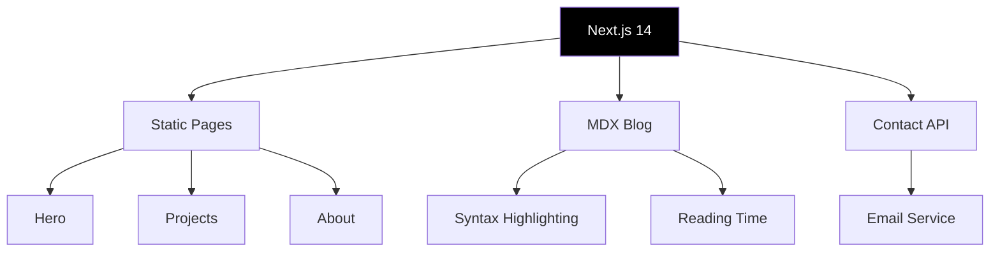

# Day 6 (Day 62): Developer Portfolio 🎨

**Duration:** 6-8 hours | **Difficulty:** ⭐⭐⭐ Project

---

## 📖 Project Overview

Build a stunning developer portfolio with blog, project showcase, and contact form.

---

## 🎯 Features

- Hero section with animation
- Projects gallery
- MDX blog system
- Contact form
- SEO optimization
- Dark mode
- Responsive design

---

## 🏗️ Architecture

---

## ✅ Implementation Checklist

- [ ] Hero section with animations
- [ ] Skills showcase
- [ ] Projects gallery
- [ ] Project case studies
- [ ] MDX blog setup
- [ ] Syntax highlighting
- [ ] Contact form
- [ ] Email integration
- [ ] SEO metadata
- [ ] Open Graph images
- [ ] Sitemap generation
- [ ] RSS feed
- [ ] Analytics integration
- [ ] Resume download
- [ ] Dark mode toggle
- [ ] Responsive design
- [ ] Deploy to Vercel

---

**Tomorrow:** Open Source Contribution! 🌟
