# Day 7 (Day 63): Open Source Contribution 🌟

**Duration:** 6-8 hours | **Difficulty:** ⭐⭐⭐⭐ Learning

---

## 📖 Overview

Learn to contribute to open source projects, understand codebases, and make your first contribution!

---

## 🎯 Goals


---

## 🔍 Finding Projects

### **Where to Look**

1. **GitHub Explore**
   - [github.com/explore](https://github.com/explore)
   - Filter by language and topics

2. **Good First Issue**
   - [goodfirstissue.dev](https://goodfirstissue.dev)
   - [firsttimersonly.com](https://www.firsttimersonly.com)

3. **Your Favorite Tools**
   - Next.js, React, Tailwind CSS
   - Tools you use daily

---

## 📚 Project Selection Criteria

```typescript
// Good project checklist
const goodProject = {
  // Active development
  lastCommit: 'within 3 months',
  openIssues: 'manageable count',
  pullRequests: 'being reviewed',
  
  // Good documentation
  readme: 'comprehensive',
  contributingGuide: 'exists',
  codeOfConduct: 'exists',
  
  // Welcoming community
  issueLabels: 'good-first-issue, help-wanted',
  maintainerResponsiveness: 'active',
  existingContributors: 'diverse',
}
```

---

## 🛠️ Setup Process

### **1. Fork & Clone**

```bash
# Fork on GitHub, then clone your fork
git clone https://github.com/YOUR-USERNAME/project-name.git
cd project-name

# Add upstream remote
git remote add upstream https://github.com/ORIGINAL-OWNER/project-name.git
```

### **2. Install Dependencies**

```bash
# Follow project's README
npm install
# or
pnpm install
# or
yarn install
```

### **3. Run Locally**

```bash
# Start development server
npm run dev

# Run tests
npm test
```

---

## 📖 Understanding the Codebase

### **Reading Strategy**


### **Questions to Ask**

- What problem does this solve?
- How is the code organized?
- What are the key abstractions?
- How do components interact?
- Where are tests located?

---

## 🐛 Making Your First Contribution

### **Types of Contributions**

1. **Documentation**
   - Fix typos
   - Improve examples
   - Add missing docs

2. **Bug Fixes**
   - Reproduce issue
   - Identify cause
   - Write test
   - Fix bug

3. **Features**
   - Discuss in issue first
   - Follow coding style
   - Add tests
   - Update docs

---

## 📝 Creating a Pull Request

### **PR Template**

```markdown
## Description
Brief description of changes

## Motivation
Why is this change needed?

## Changes Made
- Added X feature
- Fixed Y bug
- Updated Z documentation

## Testing
How to test these changes

## Screenshots (if applicable)

## Checklist
- [ ] Tests pass
- [ ] Documentation updated
- [ ] Code follows project style
- [ ] Commit messages are clear
```

---

## ✅ Best Practices

### **Before Contributing**

```typescript
const contributionChecklist = {
  // Communication
  readGuidelines: true,
  checkExistingIssues: true,
  askQuestions: 'in issues or discussions',
  
  // Code quality
  followStyle: 'use project's linter',
  writeTests: 'for new features',
  updateDocs: 'if behavior changes',
  
  // Git hygiene
  branchName: 'descriptive and specific',
  commits: 'atomic and clear',
  upToDate: 'rebase on main/master',
}
```

---

## 🎓 Learning from Reviews

### **Receiving Feedback**

```mermaid
graph LR
    A[PR Submitted] --> B[Review Received]
    B --> C{Feedback Type?}
    
    C -->|Changes Requested| D[Make Updates]
    C -->|Approved| E[Celebrate!]
    C -->|Questions| F[Clarify]
    
    D --> G[Push Changes]
    F --> G
    G --> B
    
    E --> H[Merged! 🎉]
    
    style H fill:#4CAF50
```



---

## 📊 Tracking Your Contributions

### **Build Your Profile**

- Consistent contributions
- Diverse projects
- Quality over quantity
- Maintain relationships
- Help other contributors

---

## 🌟 Recommended Projects

### **Beginner-Friendly**

1. **Next.js**
   - [github.com/vercel/next.js](https://github.com/vercel/next.js)
   - Look for `good first issue` label

2. **Shadcn UI**
   - [github.com/shadcn-ui/ui](https://github.com/shadcn-ui/ui)
   - Documentation improvements

3. **React**
   - [github.com/facebook/react](https://github.com/facebook/react)
   - Documentation and examples

---

## ✅ Implementation Checklist

- [ ] Find suitable project
- [ ] Read all documentation
- [ ] Setup local development
- [ ] Understand codebase
- [ ] Find good first issue
- [ ] Ask questions if needed
- [ ] Make changes locally
- [ ] Write/update tests
- [ ] Follow commit conventions
- [ ] Create pull request
- [ ] Respond to feedback
- [ ] Get merged!

---

## 🎉 Celebration

**You've completed Week 9!**

- ✅ Built 7 production projects
- ✅ Integrated real payments (Stripe)
- ✅ Implemented real-time features
- ✅ Used AI APIs (OpenAI)
- ✅ Created analytics dashboards
- ✅ Built developer portfolio
- ✅ Contributed to open source

**You're now a complete full-stack developer!** 🚀
